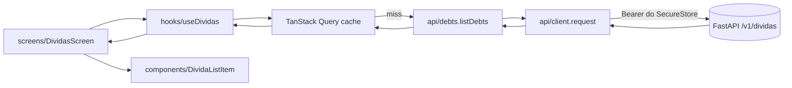

# Arquitetura — front do devo.nada

> Documento vivo. Decisões duradouras viram ADR em `docs/adr/` (ver seção final).
> Escopo: **o cliente Expo / React Native**. O backend FastAPI em `backend/` faz parte do mesmo
> repositório e é desenvolvido junto — sua arquitetura está em `backend.md`, e o contrato entre
> os dois, em `api-contract.md`.

---

## 1. Princípios

Estes princípios vencem qualquer conveniência de implementação.

1. **Cliente burro, backend gordo.** O app renderiza e coleta input. Cálculo determinístico,
   orquestração de LLM e regra de negócio vivem no servidor. Isso não é preguiça: é o que
   permite corrigir uma regra de juros sem publicar uma nova versão na App Store.
2. **Um único egress.** Toda rede passa por `src/api/client.ts`. Auth, serialização e erro são
   resolvidos uma vez.
3. **Domínio tipado, compartilhado, explícito.** `src/api/types.ts` é o espelho do contrato.
   Quando ele muda, `api-contract.md` muda junto.
4. **Estado de servidor não é estado de UI.** Cache, revalidação e invalidação são
   responsabilidade do TanStack Query; `useState` cuida só do que é efêmero na tela.
5. **Toda tela trata quatro estados.** Carregando, erro, vazio e conteúdo. Não existe tela que
   só implementa o caminho feliz — em rede móvel, o caminho feliz é o caso raro.
6. **Multi-tenant desde já.** O tenant vem do token. Trocar de "só você" para N usuários não
   deve exigir refatorar o cliente.

---

## 2. Camadas e regra de dependência

```
config/  →  api/  →  hooks/  →  screens/  →  components/
```

A seta é a direção permitida da dependência. Em particular:

- **`api/` não conhece React.** São funções assíncronas puras sobre `request<T>()`. Podem ser
  chamadas de um teste sem montar componente.
- **`hooks/` é a única camada que chama `api/`.** É onde mora `useQuery`/`useMutation`, a chave
  de cache e a política de invalidação.
- **`screens/` compõe.** Consome hooks, decide layout, resolve navegação.
- **`components/` é burro.** Recebe dado por prop e emite evento por callback. Um componente
  que importa de `src/api/` está errado — isso o torna impossível de reusar e de testar
  isoladamente. A única exceção histórica é `ValorJustoCard`, que usa `expo-clipboard`
  (capacidade do dispositivo, não dado remoto).

### 2.1 Fluxo de uma leitura



### 2.2 Fluxo de uma escrita

Mutação → `onSuccess` invalida as chaves afetadas → as telas que dependem delas revalidam.
Atualização otimista só onde o custo de errar é baixo e o rollback é trivial (marcar parcela
como paga, por exemplo). Nunca em criação de recurso, onde o `id` só existe depois da resposta.

---

## 3. Navegação

`expo-router` (file-based), adotado em M0. Ver ADR 0001.

```
app/
  _layout.tsx                    QueryClientProvider, SafeArea, fontes, tema, gate de sessão
  (auth)/
    _layout.tsx                  pilha das telas de conta (M8)
    login.tsx                    entrar / criar conta — social inerte, divisor, e-mail (tela 11)
    registro.tsx                 criar conta
    esqueci-senha.tsx            pede o código
    redefinir-senha.tsx          código + senha nova
  (onboarding)/                  entrada pelo alívio (M13). SEM barra de abas, de propósito
    _layout.tsx                  pilha; a triagem trava o gesto de voltar (ADR 0016)
    divida.tsx                   passo 1 — "qual dívida tira seu sono?", escolha MÚLTIPLA
    entrada.tsx                  passo 2 — documento (1 dívida) ou fila de dois campos (várias)
    triagem.tsx                  passo 3 — cobrado × justo, ou "ainda não calculado"
  (tabs)/
    _layout.tsx                  Rota · Dívidas · Metas · Tino · Caixa — cinco abas, sem ícone
    index.tsx                    Chat (rótulo "Tino")
    dividas/
      _layout.tsx                pilha da aba
      index.tsx                  lista
      nova.tsx                   formulário de criação
      simulador.tsx              simulador de quitação (M4)
      [id]/index.tsx             detalhe
      [id]/editar.tsx            edição
      [id]/plano.tsx             cronograma de parcelas (M3)
      [id]/renegociar.tsx        registro de acordo (M3)
      [id]/revisao.tsx           revisão de cobrança (M6)
      contrato/index.tsx         envio de contrato (M1.5)
      contrato/[id].tsx          revisão da extração (M1.5)
    caixa/
      _layout.tsx                pilha da aba
      index.tsx                  a cascata e as duas capacidades (M7)
      renda.tsx                  fontes e registro de recebimento (M7)
      gastos.tsx                 gastos, essenciais e cortáveis (M7)
      provisoes.tsx              despesas anuais — IPVA, seguro (M7)
      metas.tsx                  "Seus potes": imposto, reserva e aposentadoria (M7)
    metas/                       "Suas metas": metas nomeadas (M12). COISA DIFERENTE de caixa/metas
      _layout.tsx                pilha da aba
      index.tsx                  a Rota de Chegada (tela 09)
      nova.tsx                   formulário de criação
      [id]/editar.tsx            edição e exclusão
    painel/
      _layout.tsx                pilha da aba
      index.tsx                  painel de endividamento
      preferencias.tsx           dependentes, lembretes, assinatura, sair e excluir conta
      assinatura.tsx             situação, assinar, restaurar e gerenciar (M9)
      excluir-conta.tsx          confirmação da exclusão (M8)
```

**Por que Caixa é aba e não uma tela do Painel:** o Painel responde "quanto eu devo"; o Caixa
responde "quanto eu consigo pagar". A segunda pergunta é a que restringe todo plano que o produto
propõe, e enterrá-la dentro de outra aba a trataria como detalhe do diagnóstico de dívida.

Todo o **produto** vive dentro de `(tabs)/`: uma rota fora do grupo perde a barra de abas, e sair
do simulador ou do plano levaria o usuário para fora da navegação em vez de voltar para a lista.

As exceções são `(auth)/` e `(onboarding)/`, e as duas são fora **pelo mesmo raciocínio
invertido**: login com a barra de abas embaixo é convite a tocar numa aba que vai `401`ar, e exibir
quatro abas de dado financeiro a quem ainda não entrou — ou a quem ainda não cadastrou dívida
nenhuma — anuncia um app que a pessoa ainda não tem. O onboarding sai de lá com uma dívida
cadastrada e uma leitura sobre ela; aí as abas passam a ter conteúdo.

**A segunda aba troca de rótulo na fase verde:** `Dívidas` vira `Metas` quando
`estadoDaRota === 'quitado'` (tela 09 da concepção). A troca usa `href: null`, que tira da barra
**sem tirar da rota** — `/dividas` continua alcançável por `push` e por deep link, e a tela de Metas
oferece o caminho. Esconder a rota faria quem quitou tudo e contraiu uma dívida nova não ter como
cadastrá-la. Ver ADR 0017.

**Toda tela empilhada tem seta de voltar** (`PageHeader.onBack`), porque os seis layouts usam
`headerShown: false` e o header nativo não existe em lugar nenhum do app. Ver ADR 0016 e
`docs/design-system.md`, seção 5.

Rota é a unidade de deep link: um card do chat consegue apontar para `dividas/[id]` sem
conhecer a pilha de navegação. Isso é o que viabiliza M5 — e, no M6, o `valor_justo` aponta para
`dividas/[id]/revisao` pelo mesmo mecanismo.

---

## 4. Estado

| Tipo de estado | Onde vive | Exemplo |
|---|---|---|
| Servidor | TanStack Query | lista de dívidas, resumo do painel, resultado de simulação |
| UI efêmero | `useState` local | texto do composer, aba selecionada, modal aberto |
| Credencial | `expo-secure-store` | token de auth (`src/api/client.ts`) |
| Configuração | `src/config/env.ts` | `EXPO_PUBLIC_API_BASE_URL` |

Não há store global. Se um dia surgir necessidade real de estado compartilhado que não seja de
servidor, ela vira ADR antes de virar dependência.

O `useChat` atual mantém as mensagens em memória com `useState` e um `AbortController` em ref
que cancela a requisição anterior. Esse padrão permanece: conversa é um fluxo, não uma coleção
cacheável. Ver ADR 0002 para a fronteira entre os dois modelos.

### 4.1 Chaves de cache

Convenção de chave hierárquica, para invalidação por prefixo:

```ts
['dividas']                        // toda a coleção
['dividas', id]                    // um recurso
['dividas', id, 'parcelas']        // sub-recurso
['dividas', 'resumo']              // agregado do painel
['dividas', 'simulacao', params]   // resultado de simulação
```

Quitar uma dívida invalida `['dividas']` inteiro, porque o resumo do painel também muda.

---

## 5. Erro

`ApiError` (`src/api/client.ts`) é a única forma de erro que sobe da camada de rede. Carrega
`status`, `message` já legível em pt-BR e `body`. Convenções de tratamento:

| `status` | Significado | Comportamento da UI |
|---|---|---|
| `0` | sem conexão | banner "sem conexão" + botão de tentar de novo; não faz retry automático agressivo |
| `401` | sessão ausente, expirada ou revogada | tenta renovar pelo refresh; falhando, limpa a sessão e cai no login (`/login`). A tela de token e o `/painel/token` saíram no M8 (ADR 0012) |
| `404` | recurso não existe | estado vazio específico da tela, não erro genérico |
| `422` | payload inválido | erro por campo no formulário, quando o backend indicar o campo |
| `5xx` | falha do servidor | banner de erro + retry manual |

Regra do TanStack Query: **não retenta `4xx`**. Retenta `0` e `5xx`, com backoff, no máximo
duas vezes — em rede móvel, insistir mais gasta bateria e não resolve.

**Todo erro exibido tem que ter uma ação possível.** O `401` é o caso que ensinou isso: o
backend responde "sua sessão expirou" (`backend/auth.py`), mas não existe sessão no beta — é
um token estático, e a frase mandava a pessoa procurar um login inexistente. Hoje quem
decide isso é o `ErrorState`, via `isAuthError` (`src/api/client.ts`), e não cada tela: nas
telas de coleção o botão vem no próprio `ErrorState`, e no chat vem na faixa de erro, que
não bloqueia a conversa. Nenhuma tela repete o texto do backend para o `401`.

---

## 6. Configuração

`src/config/env.ts` lê `EXPO_PUBLIC_API_BASE_URL` com fallback para `http://localhost:8000`.
Esse fallback só serve para simulador; em aparelho físico com Expo Go, é preciso apontar para o
IP da máquina na rede local. `.env.example` documenta o formato.

Ele lê também os dois `EXPO_PUBLIC_PRODUTO_ASSINATURA_*` (M9) — ids de produto da loja, públicos
por natureza. `eas.json` os define por perfil de build.

Nada com prefixo `EXPO_PUBLIC_` pode ser secreto — ver `guardrails.md` seção 2.

**A partir do M9 o Expo Go não basta.** In-app purchase exige módulo nativo, e o binário do Expo
Go não o tem: o app precisa de *development build* (`eas build --profile development`). O resto do
produto continua rodando em Expo Go; só o fluxo de assinatura não.

---

## 7. Testes

| Camada | O que se testa | Ferramenta |
|---|---|---|
| `util/`, `api/` | comportamento puro: formatação de moeda, montagem de request, mapeamento de erro | Jest |
| `hooks/` | estados de query, invalidação, otimismo e rollback | Jest + React Native Testing Library |
| `screens/` | os quatro estados de tela renderizam o que devem | RNTL |
| `compras/` | a ORDEM do ciclo de compra: o backend confirma antes de `finishTransaction` | Jest, com `expo-iap` mockado |

Prioridade de cobertura, nesta ordem: `src/util/money.ts` (dinheiro), `src/api/client.ts`
(auth e erro), hooks de mutação (invalidação). O resto é bônus.

---

## 8. Dívida técnica conhecida

> `.npmrc` tem `legacy-peer-deps=true`, que silencia conflito de peer dependency. Ele já
> escondeu três problemas reais em M0 (reanimated 4 sem `react-native-worklets`,
> `react-test-renderer` fora de versão com o React, e `jest` 30 sobre o ecossistema 29 do
> `jest-expo`). Ao adicionar dependência, confira a resolução manualmente com `npm ls`.

> Versões que **não** podem ser atualizadas sem verificação: `eslint` fixo em `^9` (a 10 quebra
> o `eslint-plugin-react` que vem no `eslint-config-expo`), `jest` em `^29` (o `jest-expo` 57
> traz o ecossistema 29) e `@testing-library/react-native` em `^13` (a 14.0.1 tem um import
> quebrado para um módulo `test-renderer` inexistente).

---

## 9. ADRs

| # | Decisão |
|---|---|
| [0001](adr/0001-expo-router-como-navegacao.md) | expo-router como camada de navegação |
| [0002](adr/0002-tanstack-query-para-server-state.md) | TanStack Query para estado de servidor |
| [0003](adr/0003-calculo-financeiro-fica-no-backend.md) | Todo cálculo financeiro fica no backend |
| [0004](adr/0004-paleta-hibrida-pine-e-dourado.md) | Paleta híbrida: pine primário, dourado acento (superseded pela 0010) |
| [0005](adr/0005-descarte-do-arquivo-de-contrato.md) | O arquivo do contrato é descartado após a extração |
| [0006](adr/0006-postgres-token-fixo-e-extrator-plugavel.md) | Postgres, token fixo e extrator plugável |
| [0007](adr/0007-camada-de-provedor-de-llm.md) | Camada de provedor de LLM, e OpenAI como padrão |
| [0008](adr/0008-valor-justo-e-soma-de-achados.md) | `valorJusto` é soma de achados citáveis, não estimativa |
| [0009](adr/0009-o-usuario-decide-a-ordem-dos-potes.md) | O usuário decide a ordem dos potes; o app mostra a aritmética |
| [0010](adr/0010-paleta-derivada-de-pierre-e-budgi.md) | Paleta derivada de Pierre e Budgi (superseded pela 0011) |
| [0011](adr/0011-forma-do-budgi-a-partir-das-telas.md) | A forma vem das telas do produto, não do CSS da landing |
| [0012](adr/0012-conta-de-usuario.md) | Conta de usuário: JWT curto, refresh rotacionado e a sessão como único estado global |
| [0013](adr/0013-assinatura-e-paywall.md) | Assinatura in-app: teste de 7 dias, somente leitura depois, e validação no servidor |
