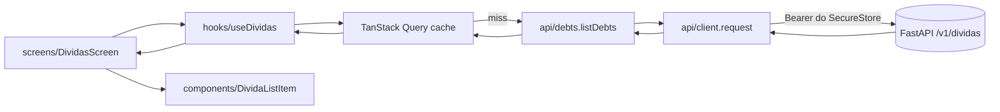

# Arquitetura — front do Buddy Financeiro

> Documento vivo. Decisões duradouras viram ADR em `docs/adr/` (ver seção final).
> Escopo: **o cliente Expo / React Native**. O backend FastAPI em `backend/` é desenvolvido
> separadamente; o que o front espera dele está em `api-contract.md`.

---

## 1. Princípios

Estes princípios vencem qualquer conveniência de implementação.

1. **Cliente burro, backend gordo.** O app renderiza e coleta input. Cálculo determinístico,
   orquestração de LLM e regra de negócio vivem no servidor. Isso não é preguiça: é o que
   permite corrigir uma regra de juros sem publicar uma nova versão na App Store.
2. **Um único egress.** Toda rede passa por `src/api/client.ts`. Auth, serialização e erro são
   resolvidos uma vez.
3. **Domínio tipado, compartilhado, explícito.** `src/api/types.ts` é o espelho do contrato.
   Quando ele muda, `api-contract.md` muda junto.
4. **Estado de servidor não é estado de UI.** Cache, revalidação e invalidação são
   responsabilidade do TanStack Query; `useState` cuida só do que é efêmero na tela.
5. **Toda tela trata quatro estados.** Carregando, erro, vazio e conteúdo. Não existe tela que
   só implementa o caminho feliz — em rede móvel, o caminho feliz é o caso raro.
6. **Multi-tenant desde já.** O tenant vem do token. Trocar de "só você" para N usuários não
   deve exigir refatorar o cliente.

---

## 2. Camadas e regra de dependência

```
config/  →  api/  →  hooks/  →  screens/  →  components/
```

A seta é a direção permitida da dependência. Em particular:

- **`api/` não conhece React.** São funções assíncronas puras sobre `request<T>()`. Podem ser
  chamadas de um teste sem montar componente.
- **`hooks/` é a única camada que chama `api/`.** É onde mora `useQuery`/`useMutation`, a chave
  de cache e a política de invalidação.
- **`screens/` compõe.** Consome hooks, decide layout, resolve navegação.
- **`components/` é burro.** Recebe dado por prop e emite evento por callback. Um componente
  que importa de `src/api/` está errado — isso o torna impossível de reusar e de testar
  isoladamente. A única exceção histórica é `ValorJustoCard`, que usa `expo-clipboard`
  (capacidade do dispositivo, não dado remoto).

### 2.1 Fluxo de uma leitura



### 2.2 Fluxo de uma escrita

Mutação → `onSuccess` invalida as chaves afetadas → as telas que dependem delas revalidam.
Atualização otimista só onde o custo de errar é baixo e o rollback é trivial (marcar parcela
como paga, por exemplo). Nunca em criação de recurso, onde o `id` só existe depois da resposta.

---

## 3. Navegação

`expo-router` (file-based), adotado em M0. Ver ADR 0001.

```
app/
  _layout.tsx                 QueryClientProvider, SafeArea, fontes, tema
  (tabs)/
    _layout.tsx               três abas
    index.tsx                 Chat
    dividas/
      index.tsx               lista
      [id].tsx                detalhe
      nova.tsx                formulário de criação
    painel.tsx                painel de endividamento
  dividas/[id]/plano.tsx      cronograma de parcelas (M3)
  dividas/simulador.tsx       simulador de quitação (M4)
```

Rota é a unidade de deep link: um card do chat consegue apontar para `dividas/[id]` sem
conhecer a pilha de navegação. Isso é o que viabiliza M5.

---

## 4. Estado

| Tipo de estado | Onde vive | Exemplo |
|---|---|---|
| Servidor | TanStack Query | lista de dívidas, resumo do painel, resultado de simulação |
| UI efêmero | `useState` local | texto do composer, aba selecionada, modal aberto |
| Credencial | `expo-secure-store` | token de auth (`src/api/client.ts`) |
| Configuração | `src/config/env.ts` | `EXPO_PUBLIC_API_BASE_URL` |

Não há store global. Se um dia surgir necessidade real de estado compartilhado que não seja de
servidor, ela vira ADR antes de virar dependência.

O `useChat` atual mantém as mensagens em memória com `useState` e um `AbortController` em ref
que cancela a requisição anterior. Esse padrão permanece: conversa é um fluxo, não uma coleção
cacheável. Ver ADR 0002 para a fronteira entre os dois modelos.

### 4.1 Chaves de cache

Convenção de chave hierárquica, para invalidação por prefixo:

```ts
['dividas']                        // toda a coleção
['dividas', id]                    // um recurso
['dividas', id, 'parcelas']        // sub-recurso
['dividas', 'resumo']              // agregado do painel
['dividas', 'simulacao', params]   // resultado de simulação
```

Quitar uma dívida invalida `['dividas']` inteiro, porque o resumo do painel também muda.

---

## 5. Erro

`ApiError` (`src/api/client.ts`) é a única forma de erro que sobe da camada de rede. Carrega
`status`, `message` já legível em pt-BR e `body`. Convenções de tratamento:

| `status` | Significado | Comportamento da UI |
|---|---|---|
| `0` | sem conexão | banner "sem conexão" + botão de tentar de novo; não faz retry automático agressivo |
| `401` | token inválido ou expirado | limpa o token (`clearToken`) e envia para o fluxo de login |
| `404` | recurso não existe | estado vazio específico da tela, não erro genérico |
| `422` | payload inválido | erro por campo no formulário, quando o backend indicar o campo |
| `5xx` | falha do servidor | banner de erro + retry manual |

Regra do TanStack Query: **não retenta `4xx`**. Retenta `0` e `5xx`, com backoff, no máximo
duas vezes — em rede móvel, insistir mais gasta bateria e não resolve.

---

## 6. Configuração

`src/config/env.ts` lê `EXPO_PUBLIC_API_BASE_URL` com fallback para `http://localhost:8000`.
Esse fallback só serve para simulador; em aparelho físico com Expo Go, é preciso apontar para o
IP da máquina na rede local. `.env.example` documenta o formato.

Nada com prefixo `EXPO_PUBLIC_` pode ser secreto — ver `guardrails.md` seção 2.

---

## 7. Testes

| Camada | O que se testa | Ferramenta |
|---|---|---|
| `util/`, `api/` | comportamento puro: formatação de moeda, montagem de request, mapeamento de erro | Jest |
| `hooks/` | estados de query, invalidação, otimismo e rollback | Jest + React Native Testing Library |
| `screens/` | os quatro estados de tela renderizam o que devem | RNTL |

Prioridade de cobertura, nesta ordem: `src/util/money.ts` (dinheiro), `src/api/client.ts`
(auth e erro), hooks de mutação (invalidação). O resto é bônus.

---

## 8. Dívida técnica conhecida

> `.npmrc` tem `legacy-peer-deps=true`, que silencia conflito de peer dependency. Ele já
> escondeu três problemas reais em M0 (reanimated 4 sem `react-native-worklets`,
> `react-test-renderer` fora de versão com o React, e `jest` 30 sobre o ecossistema 29 do
> `jest-expo`). Ao adicionar dependência, confira a resolução manualmente com `npm ls`.

> Versões que **não** podem ser atualizadas sem verificação: `eslint` fixo em `^9` (a 10 quebra
> o `eslint-plugin-react` que vem no `eslint-config-expo`), `jest` em `^29` (o `jest-expo` 57
> traz o ecossistema 29) e `@testing-library/react-native` em `^13` (a 14.0.1 tem um import
> quebrado para um módulo `test-renderer` inexistente).

---

## 9. ADRs

| # | Decisão |
|---|---|
| [0001](adr/0001-expo-router-como-navegacao.md) | expo-router como camada de navegação |
| [0002](adr/0002-tanstack-query-para-server-state.md) | TanStack Query para estado de servidor |
| [0003](adr/0003-calculo-financeiro-fica-no-backend.md) | Todo cálculo financeiro fica no backend |
| [0004](adr/0004-paleta-hibrida-pine-e-dourado.md) | Paleta híbrida: pine primário, dourado acento |
