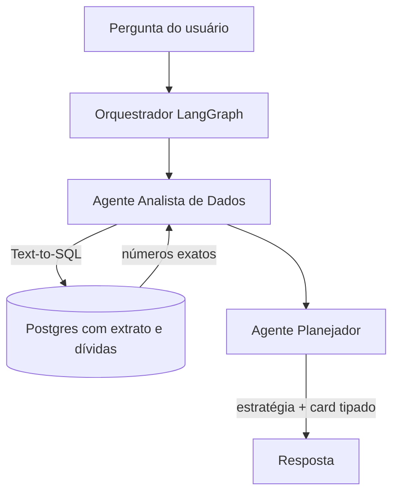

# Ingestão de dados financeiros — Open Finance e pipeline próprio

> **Direção, não compromisso.** Nada neste documento está no MVP. Ideias de produto podem sair
> daqui, mas nunca se sobrepõem aos documentos canônicos (`guardrails.md`, `architecture.md`,
> `api-contract.md`, ADRs aceitas).
> Escopo: **backend e infraestrutura**. O front não muda de arquitetura por causa disto — para
> ele, dado agregado continua chegando por endpoint autenticado, como qualquer outro.

---

> **Já existe uma ingestão real no produto.** O M1.5 lê o contrato de empréstimo, consignado ou
> financiamento e propõe o cadastro preenchido — ver `docs/features/002-ingestao-de-contrato.md`
> e ADR 0005. Ele antecipa boa parte da discussão abaixo: consentimento explícito, descarte do
> bruto, extração como proposta e não como verdade. O que ele **não** resolve é o fluxo contínuo:
> contrato é uma foto do passado, extrato é o filme.

---

## 1. Por que isto importa

O produto hoje enxerga o que o usuário digita. Isso basta para a vertical de dívidas, mas trava
o assistente num papel de oráculo de dicas.

O salto acontece quando existe **contexto contínuo de fluxo de caixa**: entradas, gastos,
rentabilidade da reserva de emergência, aportes de aposentadoria. Com isso, a pergunta "como
está meu orçamento para a viagem, e os aportes da aposentadoria?" deixa de ser respondida com
princípios genéricos e passa a ser respondida com números.

É também o maior salto de complexidade, de custo e de risco regulatório do roadmap. Por isso
está aqui e não em `roadmap.md`.

---

## 2. O obstáculo regulatório

**Não é possível plugar um script ou aplicativo pessoal diretamente nas APIs de Open Finance dos
bancos brasileiros.** O Banco Central exige que qualquer integração direta seja feita por
instituição financeira ou de pagamento autorizada, com certificação e requisitos de segurança
rigorosos (FAPI, mTLS, certificados ICP-Brasil, registro no diretório de participantes).

Um projeto individual não obtém essa habilitação. Restam dois caminhos viáveis.

---

## 3. Caminho A — agregador (API pronta)

Empresas de Banking as a Service já fizeram a homologação no Bacen e revendem o acesso como API
REST. **Pluggy** e **Belvo** são as mais conhecidas no Brasil.

O fluxo:

1. O agregador fornece um link ou widget de conexão.
2. O usuário autentica as próprias contas (Nubank, Itaú, Sofisa, o que for) e consente com o
   compartilhamento.
3. A partir daí, o backend consome uma API REST limpa: extrato padronizado, saldo, dados de
   cartão de crédito, investimentos.

Ambas têm plano de sandbox ou tier de desenvolvedor, suficiente para teste e projeto pequeno.

**A favor:** dado padronizado e categorizado, atualização automática, cobertura ampla de
instituições, conformidade resolvida por terceiro.
**Contra:** custo por conexão que escala com o número de usuários, dependência de um fornecedor
no caminho crítico do produto, e um terceiro a mais com acesso a dado financeiro sensível — o
que muda a análise de LGPD.

---

## 4. Caminho B — pipeline próprio

Mais barato e sob controle, ao custo de trabalho manual do usuário.

### 4.1 Exportação OFX/CSV

A forma mais simples. O usuário exporta o arquivo pelo internet banking e o deposita num bucket
(S3 ou GCS). OFX é XML padronizado — o parse é determinístico e não depende de scraping.

### 4.2 Pipeline n8n + Postgres

Um fluxo no **n8n** escuta o bucket, faz o parse do OFX, categoriza as despesas e insere num
Postgres. A partir daí o backend do devo.nada lê de uma base própria, sem dependência externa em
runtime.

### 4.3 Webhook de notificação push

Tática complementar para tempo real: um app de automação no celular (Tasker no Android,
Macrodroid) intercepta a notificação push do aplicativo do banco a cada compra e dispara um
webhook para o n8n, populando a base no momento da transação.

**A favor:** custo próximo de zero, nenhum terceiro com acesso amplo, controle total do dado.
**Contra:** exige disciplina do usuário para exportar; a interceptação de notificação é frágil
(quebra quando o banco muda o texto do push) e cobre só o valor e o estabelecimento, sem
categoria nem identificador estável.

---

## 5. Como isso encaixa na arquitetura do agente

O erro tentador aqui é passar o extrato bruto para o LLM. Isso consome muitos tokens, escala
mal, e **produz alucinação numérica** — modelo de linguagem não é planilha.

A separação correta, orquestrada por LangGraph:

1. O **Agente Analista** traduz a pergunta em SQL e executa no Postgres.
2. O banco devolve números exatos: "R$ 3.000 no cartão, R$ 1.500 aportados em renda fixa".
3. O **Agente Planejador** recebe esses números prontos e formula a resposta estratégica,
   projetando se a meta será atingida.

A matemática é determinística no banco; o LLM só interpreta o resultado e traça a estratégia.
Isso é a mesma regra do ADR 0003, aplicada uma camada acima — e é o que permite que os números
cheguem ao front em **card tipado**, como `guardrails.md`, seção 7.1, exige.

### 5.1 Guardrails específicos desta camada

- Text-to-SQL é superfície de injeção. A query gerada roda com usuário de banco **somente
  leitura**, escopado por tenant, com timeout e limite de linhas.
- Extrato bancário é conteúdo não confiável: descrição de transação pode conter instrução
  embutida. Nunca entra no prompt sem sanitização.
- Nenhum dado de extrato transita para o cliente sem agregação. O front recebe resumo e card,
  nunca a tabela bruta.
- Consentimento é revogável, e revogar precisa apagar o dado — não só cortar a sincronização.

---

## 6. Recomendação

Se e quando isto entrar no roadmap: **começar pelo caminho B**, com exportação OFX manual. Ele
prova a tese do produto (contexto contínuo melhora a resposta do assistente) sem custo recorrente,
sem contrato com fornecedor e sem ampliar a superfície de LGPD antes de haver usuários.

Migrar para agregador é uma decisão de escala, a ser tomada quando o atrito da exportação manual
for medido — não presumido.

Qualquer que seja o caminho, ele vira **ADR** antes de virar código.
