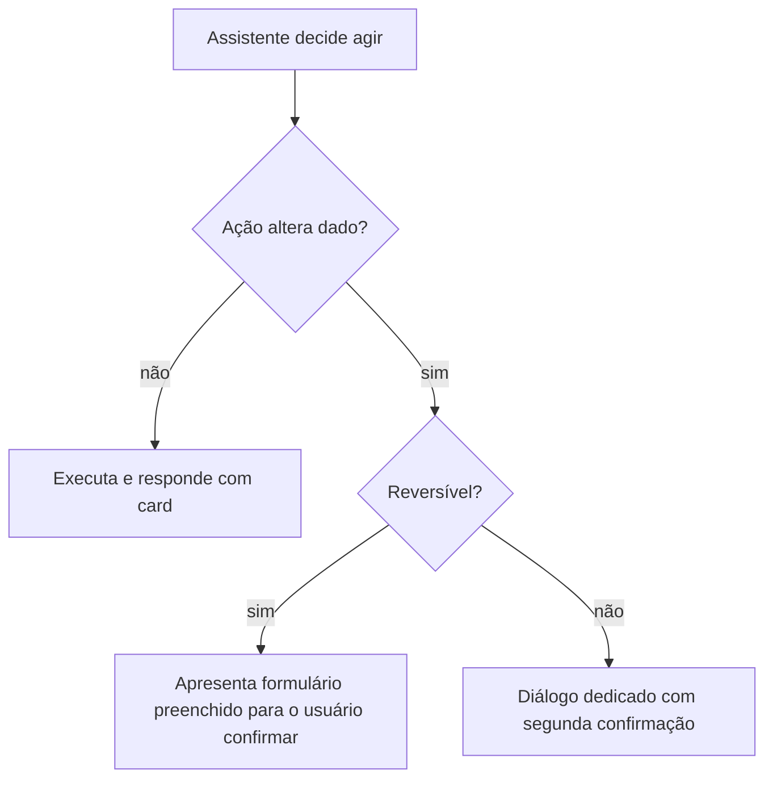

# Guardrails — dinheiro, segurança, postura e IA

> Documento vivo. Complementa `architecture.md`.
> Princípio-mãe: **o app não é fonte da verdade sobre dinheiro, e o LLM não é fonte da verdade
> sobre nada.** O backend calcula e persiste; o modelo orquestra e interpreta; o front formata
> e exibe. O comportamento *fail-safe* é **não afirmar**, nunca estimar.

Guardrail não é um prompt bem escrito nem um comentário no código — são camadas independentes.
A falha de uma não pode derrubar as outras.

---

## 1. Dinheiro

### 1.1 Centavo inteiro, sempre

Todo valor monetário é `number` inteiro em **centavos**, do input do usuário ao payload da API
ao render. Nunca float, nunca string com vírgula circulando pela lógica.

- Formatação: exclusivamente `formatBRL` em `src/util/money.ts`. Ele faz aritmética inteira de
  propósito — não troque por `Intl.NumberFormat`, cuja disponibilidade varia entre engines do
  React Native e cuja saída muda com o locale do aparelho.
- Entrada: o `CurrencyInput` (ver `design-system.md`) mantém o estado em centavos e nunca faz
  `parseFloat`.
- **Modo de falha que isso previne:** `0.1 + 0.2 = 0.30000000000000004`. Numa tela de dívida,
  isso vira "R$ 1.234,57" num card e "R$ 1.234,56" em outro, para o mesmo dado. O usuário perde
  a confiança no app inteiro por um centavo.

### 1.2 O app nunca calcula valor derivado

Juros, correção monetária, valor justo, amortização, saldo devedor projetado, total de uma
lista, percentual de comprometimento de renda, economia de uma estratégia de quitação: **tudo
vem pronto do backend**, em campo tipado.

O front pode fazer:

- formatação (`formatBRL`);
- comparação para ordenar ou destacar (`a.valorCobrado > b.valorCobrado`);
- uma subtração puramente ilustrativa entre dois valores que o backend já enviou, quando o
  resultado é a diferença literal entre eles e não uma regra de negócio — é o que
  `ValorJustoCard` faz com `economia = valorCobrado - valorJusto`.

O front **não pode**:

- somar uma coluna para produzir o "total devido" do painel — isso é `GET /v1/dividas/resumo`;
- rodar uma simulação de avalanche ou bola de neve localmente — isso é
  `POST /v1/dividas/simulacoes`;
- aplicar taxa de juros, IPCA, multa ou qualquer índice.

**Modo de falha que isso previne:** duas implementações da mesma regra (uma em Python, outra em
TypeScript) divergem no arredondamento ou na regra de carência, e o app passa a mostrar um
número que o backend não reconhece. Num produto sobre dívida, esse número vira argumento numa
negociação real com um credor. Ver ADR 0003.

### 1.3 Números exibidos têm procedência

Todo número na tela veio de um campo tipado da API. Se um valor não veio, a UI mostra a ausência
("ainda não calculado") em vez de improvisar um placeholder numérico.

---

## 2. Segredos e superfície de rede

- **Nenhuma chave de LLM, de agregador ou de terceiro no app.** `OPENAI_API_KEY`,
  `ANTHROPIC_API_KEY`, credencial de Pluggy/Belvo e afins ficam no backend. O app só fala com a
  própria API autenticada.
- **`EXPO_PUBLIC_*` é público.** Qualquer coisa com esse prefixo é embutida no bundle JS e
  legível por quem baixar o APK. Só `EXPO_PUBLIC_API_BASE_URL` mora ali. Se um dia algo secreto
  precisar existir no cliente, a resposta é *mover para o backend*, não ofuscar.
- **`src/api/client.ts` é o único egress de rede.** Nenhum `fetch`, `axios` ou `XMLHttpRequest`
  fora dele. Isso concentra Bearer token, serialização, `AbortSignal` e normalização de erro num
  arquivo só — e torna auditável, num `grep`, tudo que o app envia para fora.
- **Token só em `expo-secure-store`.** Nunca em `AsyncStorage`, nunca em estado global
  serializado, nunca em log.
- **Modo de falha que isso previne:** uma chave de LLM no bundle é extraída em minutos e vira
  conta de milhares de reais no cartão do dono do repo.

---

## 3. Postura jurídica

O produto fala sobre dívida, prescrição e negociação. Isso é território sensível.

- **"Estimativa educacional. Não é aconselhamento jurídico."** O aviso é propriedade do
  componente que exibe o número — é assim que `src/components/cards/ValorJustoCard.tsx` já
  funciona. Não vire um banner solto no rodapé do app, que o usuário aprende a ignorar, nem um
  aceite único no onboarding.
- **`possivelPrescricao` é um alerta para investigar, nunca uma afirmação.** A copy é
  "pode ter prescrito — vale checar", jamais "esta dívida prescreveu". O front nunca transforma
  o booleano em asserção.
- **O app não redige petição nem instrui a não pagar.** Script de negociação (campo `script` de
  `ValorJustoCardData`) é gerado no backend, curado, e apresentado como sugestão editável.
- **Fundamentos legais são texto vindo do backend** (`fundamentos`), curados. O front nunca
  compõe citação de artigo de lei a partir de string local nem deixa o LLM improvisar uma.

**Modo de falha que isso previne:** o usuário leva ao credor um número ou um argumento jurídico
que o app apresentou com confiança demais, perde a negociação e responsabiliza o produto.

---

## 4. Tom anti-ansiedade

A tese emocional está escrita no código, em `src/theme/theme.ts`: reduzir ansiedade, não gerar
alarme. Quem chega neste app já está com medo do próprio extrato.

- **Vermelho é exceção.** `colors.danger` existe para ação destrutiva e erro real. Não é a cor
  de "você está devendo". Saldo devedor não é vermelho; é `ink` com contexto.
- **Proibido:** contagem regressiva de juros correndo em tempo real, badge de urgência
  artificial, notificação fora do horário combinado, gamificação que trata atraso como derrota
  moral, comparação com "outros usuários".
- **Progresso é destacado com o acento dourado** (`colors.accent`): parcela quitada, economia
  obtida, meses a menos. O app celebra o avanço, não pune o atraso.
- Copy usa segunda pessoa e é específica. "Faltam 7 parcelas" em vez de "Atenção: dívida ativa".

---

## 5. Privacidade e LGPD

Dado financeiro pessoal é dado sensível na prática, mesmo quando não é na letra da lei.

- **Nunca em log.** Valor, nome de credor, CPF, e-mail e identificador de conta não vão para
  `console.log`, analytics, breadcrumb de crash reporter nem telemetria. Se precisar depurar,
  logue o `id` do recurso, não o conteúdo.
- **Nunca em mensagem de erro genérica.** `ApiError.message` é exibido ao usuário; o backend não
  deve devolver conteúdo sensível nele, e o front não deve concatenar dados no texto de erro.
- **Sem cache em texto plano.** Se um dia entrar persistência offline, ela usa storage cifrado —
  não `AsyncStorage` cru.
- **Minimização:** o front não pede dado que nenhuma tela usa.
- Proteção contra screenshot nas telas de dívida é item de `roadmap.md` (pós-MVP), não uma
  garantia atual.

---

## 6. Multi-tenant

`tenant_id` vem do token de autenticação e **o cliente nunca o envia**. A invariante já está
declarada em `src/api/types.ts`.

- Não introduza parâmetro de tenant em query string, body ou header.
- Não guarde identificador de tenant em estado do app para "filtrar depois". O isolamento é
  responsabilidade do backend; qualquer filtragem no cliente é teatro de segurança.
- **Modo de falha que isso previne:** vazamento cross-tenant é o incidente número um de um
  produto financeiro. Se o cliente pode informar o tenant, ele pode informar o do vizinho.

---

## 7. Guardrails de IA

O chat é a superfície mais perigosa do produto, porque texto livre parece autoridade.

### 7.1 Sem fonte, sem afirmação

- Todo número que o assistente comunica chega em **card tipado** (`ActionCardData`), não no
  corpo de texto da mensagem. O `content` da mensagem contextualiza; o card carrega o dado.
- Se o backend não conseguiu calcular, a resposta correta é "não sei / preciso de mais dados",
  nunca uma estimativa. Recusar é melhor que estimar.
- O front **não conserta** resposta do modelo: se vier um número no texto livre sem card
  correspondente, isso é bug de backend a ser reportado, não algo a mascarar na UI.

### 7.2 Autonomia por classe de ação

| Classe de ação | Exemplo | Autonomia | Confirmação |
|---|---|---|---|
| Leitura / consulta | listar dívidas, resumir o painel | Autônoma | — |
| Análise / explicação | explicar por que uma dívida é prioritária | Autônoma (com card de fonte) | — |
| Rascunho | gerar script de negociação | Autônoma (não envia nada) | — |
| Escrita reversível | criar ou editar uma dívida a partir do chat | **Confirmação explícita** | Usuário aprova o formulário preenchido |
| Marcar como quitado / pago | baixar parcela | **Confirmação explícita** | Usuário toca "Confirmar" |
| Irreversível | excluir dívida, apagar histórico | **Confirmação + segunda checagem** | Diálogo dedicado |

Nenhuma escrita acontece como efeito colateral silencioso de uma conversa.

### 7.3 Entrada não confiável

Texto colado pelo usuário (extrato, e-mail de cobrança, print de boleto) e conteúdo vindo de
integração externa são **não confiáveis**. Instrução embutida nesse conteúdo não vira comando.
A defesa mora no backend, mas o front não facilita: nunca renderize HTML de origem remota nem
execute deep link vindo de campo de texto sem validar o esquema.

---

## 8. Documento enviado pelo usuário

O contrato de empréstimo, consignado ou financiamento (M1.5) é a entrada mais sensível do
produto e a que mais pressiona os guardrails acima. Três regras, e elas **são** a arquitetura.

### 8.1 A extração é proposta, nunca gravação

Um modelo lendo números de contrato é o caso-limite da seção 1: LLM como fonte da verdade sobre
dinheiro. Portanto:

- Nada vira dívida sem o usuário revisar **campo a campo**, com o trecho de origem à vista.
- **Campo sem `trecho` citável é descartado**, mesmo que traga valor — número sem evidência é
  palpite, e palpite não entra em formulário de dinheiro nem pré-preenchido
  (`src/util/extracao.ts`).
- Confiança baixa entra destacada para conferência, não silenciosamente aceita.
- **Modo de falha que isso previne:** o usuário salva uma taxa que o modelo leu errado, o painel
  passa a exibi-la, o simulador prioriza a dívida errada — e nada disso é rastreável até a origem.

### 8.2 O conteúdo do contrato é entrada não confiável

Vale a seção 7.3, com uma consequência concreta na UI: **o trecho é renderizado como texto puro**.
Nunca markdown, nunca HTML, nunca link clicável a partir dele. Um PDF pode carregar instrução
embutida, e o front não é o lugar onde ela ganha efeito.

### 8.3 O arquivo é lido e descartado

Ver ADR 0005. Persistem os campos extraídos e os trechos curtos que os comprovam, nunca o
arquivo. **A UI avisa isso antes do upload** — transparência é parte do consentimento, não
cortesia.

Nenhum trecho de contrato vai para log, analytics ou mensagem de erro. Vale a seção 5, sem
exceção.

Alerta de cláusula segue a postura da seção 3: **sinal para investigar**, jamais "esta cláusula é
ilegal".

---

## 9. Checklist por pull request

- [ ] Nenhum cálculo de valor monetário novo no cliente.
- [ ] Todo dinheiro trafega e é armazenado em centavos inteiros.
- [ ] Nenhum `fetch` fora de `src/api/client.ts`.
- [ ] Nenhum segredo novo com prefixo `EXPO_PUBLIC_`.
- [ ] Nenhum dado financeiro ou pessoal em log, analytics ou mensagem de erro.
- [ ] Disclaimer jurídico acompanha todo componente que exibe valor estimado.
- [ ] Vermelho usado só para erro ou ação destrutiva.
- [ ] Toda escrita disparada pelo chat pede confirmação explícita.
- [ ] Nenhum parâmetro de tenant enviado pelo cliente.
- [ ] Nenhum campo pré-preenchido a partir de extração sem trecho que o comprove.
- [ ] Nenhum conteúdo de documento renderizado como marcação ou link.
