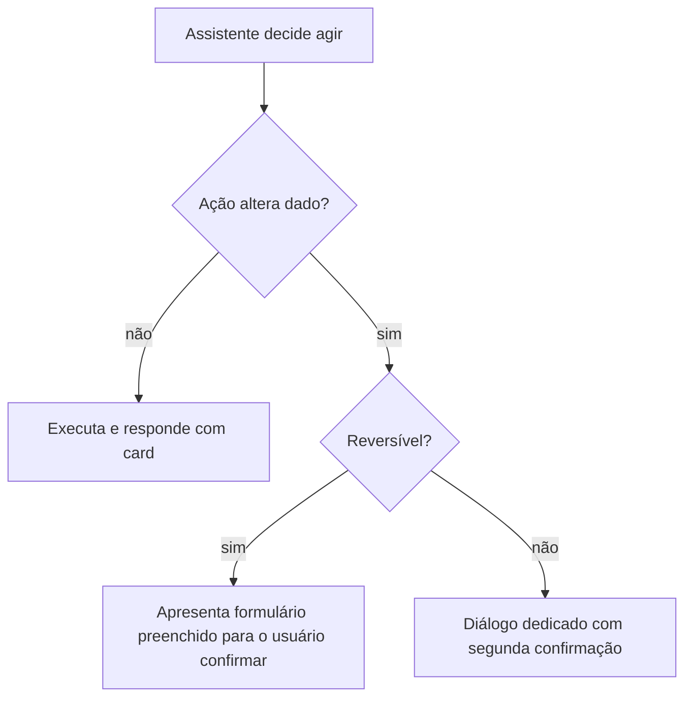

# Guardrails — dinheiro, segurança, postura e IA

> Documento vivo. Complementa `architecture.md`.
> Princípio-mãe: **o app não é fonte da verdade sobre dinheiro, e o LLM não é fonte da verdade
> sobre nada.** O backend calcula e persiste; o modelo orquestra e interpreta; o front formata
> e exibe. O comportamento *fail-safe* é **não afirmar**, nunca estimar.

Guardrail não é um prompt bem escrito nem um comentário no código — são camadas independentes.
A falha de uma não pode derrubar as outras.

---

## 1. Dinheiro

### 1.1 Centavo inteiro, sempre

Todo valor monetário é `number` inteiro em **centavos**, do input do usuário ao payload da API
ao render. Nunca float, nunca string com vírgula circulando pela lógica.

- Formatação: exclusivamente `formatBRL` em `src/util/money.ts`. Ele faz aritmética inteira de
  propósito — não troque por `Intl.NumberFormat`, cuja disponibilidade varia entre engines do
  React Native e cuja saída muda com o locale do aparelho.
- Entrada: o `CurrencyInput` (ver `design-system.md`) mantém o estado em centavos e nunca faz
  `parseFloat`.
- **Modo de falha que isso previne:** `0.1 + 0.2 = 0.30000000000000004`. Numa tela de dívida,
  isso vira "R$ 1.234,57" num card e "R$ 1.234,56" em outro, para o mesmo dado. O usuário perde
  a confiança no app inteiro por um centavo.

### 1.2 O app nunca calcula valor derivado

Juros, correção monetária, valor justo, amortização, saldo devedor projetado, total de uma
lista, percentual de comprometimento de renda, economia de uma estratégia de quitação: **tudo
vem pronto do backend**, em campo tipado.

O front pode fazer:

- formatação (`formatBRL`);
- comparação para ordenar ou destacar (`a.valorCobrado > b.valorCobrado`);
- uma subtração puramente ilustrativa entre dois valores que o backend já enviou, quando o
  resultado é a diferença literal entre eles e não uma regra de negócio — é o que
  `ValorJustoCard` faz com `economia = valorCobrado - valorJusto`.

O front **não pode**:

- somar uma coluna para produzir o "total devido" do painel — isso é `GET /v1/dividas/resumo`;
- rodar uma simulação de avalanche ou bola de neve localmente — isso é
  `POST /v1/dividas/simulacoes`;
- aplicar taxa de juros, IPCA, multa ou qualquer índice.

**Modo de falha que isso previne:** duas implementações da mesma regra (uma em Python, outra em
TypeScript) divergem no arredondamento ou na regra de carência, e o app passa a mostrar um
número que o backend não reconhece. Num produto sobre dívida, esse número vira argumento numa
negociação real com um credor. Ver ADR 0003.

### 1.3 Números exibidos têm procedência

Todo número na tela veio de um campo tipado da API. Se um valor não veio, a UI mostra a ausência
("ainda não calculado") em vez de improvisar um placeholder numérico.

---

## 2. Segredos e superfície de rede

- **Nenhuma chave de LLM, de agregador ou de terceiro no app.** `OPENAI_API_KEY`,
  `ANTHROPIC_API_KEY`, credencial de Pluggy/Belvo e afins ficam no backend. O app só fala com a
  própria API autenticada.
- **`EXPO_PUBLIC_*` é público.** Qualquer coisa com esse prefixo é embutida no bundle JS e
  legível por quem baixar o APK. Moram ali `EXPO_PUBLIC_API_BASE_URL` e os dois
  `EXPO_PUBLIC_PRODUTO_ASSINATURA_*` — **ids de produto da loja, que são públicos por natureza**:
  eles estão impressos na página da assinatura na App Store, e o SDK precisa deles antes de
  qualquer chamada ao nosso servidor. Não é exceção à regra; é a regra aplicada a um valor que não
  é segredo. Se um dia algo secreto precisar existir no cliente, a resposta é *mover para o
  backend*, não ofuscar.
- **`src/api/client.ts` é o único egress de rede.** Nenhum `fetch`, `axios` ou `XMLHttpRequest`
  fora dele. Isso concentra Bearer token, serialização, `AbortSignal` e normalização de erro num
  arquivo só — e torna auditável, num `grep`, tudo que o app envia para fora.
- **Token só em `expo-secure-store`.** Nunca em `AsyncStorage`, nunca em estado global
  serializado, nunca em log. Vale para o par inteiro da ADR 0012 — acesso e refresh.
- **Como a credencial chega ao aparelho: pelo login.** O parágrafo anterior descrevia o
  `npm run token:qr`, que lia `DEVONADA_API_TOKEN` de `backend/.env` e imprimia um QR. **Nada disso
  existe desde o M8** — o script, a tela de token e o próprio `DEVONADA_API_TOKEN` saíram junto com o
  token fixo da ADR 0006. Hoje o usuário entra com e-mail e senha, e o `src/api/sessao.ts` guarda
  o par no SecureStore.
- **Modo de falha que isso previne:** uma chave de LLM no bundle é extraída em minutos e vira
  conta de milhares de reais no cartão do dono do repo.

---

## 3. Postura jurídica

O produto fala sobre dívida, prescrição e negociação. Isso é território sensível.

- **"Estimativa educacional. Não é aconselhamento jurídico."** O aviso é propriedade do
  componente que exibe o número — é assim que `src/components/cards/ValorJustoCard.tsx` já
  funciona. Não vire um banner solto no rodapé do app, que o usuário aprende a ignorar, nem um
  aceite único no onboarding.
- **`possivelPrescricao` é um alerta para investigar, nunca uma afirmação.** A copy é
  "pode ter prescrito — vale checar", jamais "esta dívida prescreveu". O front nunca transforma
  o booleano em asserção.
- **Todo `achado` da revisão de cobrança segue o mesmo regime** (M6). Copy correta: "a taxa
  contratada está acima do teto vigente — vale contestar". Copy proibida: "esta cobrança é
  ilegal", "isto é abusivo", "você tem direito a receber de volta". Quem decide se houve abuso é
  o Judiciário; o produto aponta e cita.
  - **Todo achado carrega a fonte** — artigo, súmula ou tema repetitivo, nomeado —, o trecho
    literal do contrato quando veio da extração, e a **pergunta de fato** que só o usuário
    responde ("você pôde escolher a seguradora?"). O achado nunca conclui no lugar dele.
  - **Achado sem fonte não existe.** Teto que muda por resolução vive em configuração datada, sem
    default: não configurado ⇒ o achado não é produzido. Ver ADR 0008.
  - Os testes de copy em `backend/tests/test_revisao.py` e `src/test/screens/revisao.test.tsx`
    **falham** se "ilegal", "abusiv" ou "é seu direito" aparecerem na tela. Regra que não quebra
    nada quando violada não é guardrail.
- **O app não redige petição nem instrui a não pagar.** Script de negociação (campo `script` de
  `ValorJustoCardData`) é gerado no backend, curado, e apresentado como sugestão editável.
- **Fundamentos legais são texto vindo do backend** (`fundamentos`), curados. O front nunca
  compõe citação de artigo de lei a partir de string local nem deixa o LLM improvisar uma.

**Modo de falha que isso previne:** o usuário leva ao credor um número ou um argumento jurídico
que o app apresentou com confiança demais, perde a negociação e responsabiliza o produto.

---

## 4. Tom anti-ansiedade

A tese emocional está escrita no código, em `src/theme/theme.ts`: reduzir ansiedade, não gerar
alarme. Quem chega neste app já está com medo do próprio extrato.

**A ADR 0015 mudou a cor, não a tese.** Até ela, a regra era "saldo devedor não é vermelho". Hoje
é o contrário — `colors.debt` marca dívida, porque a marca inteira depende de ver o vermelho
desaparecer da tela conforme a pessoa quita. O que a troca revelou é que a tese anti-ansiedade
nunca morou no token de cor: ela mora nos comportamentos abaixo, e **nenhum deles afrouxou**.

- **Vermelho é status, nunca cenário.** Máximo ~10% de qualquer tela. **Nunca** como fundo de
  tela, de seção ou de botão — e **não existe botão vermelho neste app**, nem para ação
  destrutiva: ali se usa ghost mais confirmação. `colors.debt` marca saldo devedor e criticidade;
  `colors.danger` marca erro. Mesmo valor, nomes diferentes, e a tela diz qual dos dois quis dizer.
- **Proibido:** contagem regressiva de juros correndo em tempo real, badge de urgência
  artificial, notificação fora do horário combinado, gamificação que trata atraso como derrota
  moral, comparação com "outros usuários".
  - **Exceção declarada, e só uma: o ponto da splash respira** (`src/components/SplashDevoNada.tsx`).
    A regra existe contra alarme fabricado; ali não há dado, botão nem decisão — é a marca se
    apresentando numa tela onde nada está em jogo, e é onde a pessoa aprende a ler o ponto que vai
    acompanhá-la. Respeita `isReduceMotionEnabled` mostrando o ponto **parado**, não mais lento.
    **Se esta animação aparecer numa tela com dado ou ação, ela virou o que a regra proíbe.**
- **Progresso é destacado em verde** (`colors.accent`, um passo mais claro que `colors.primary`):
  parcela quitada, economia obtida, meses a menos, marco atingido. O app celebra o avanço, não
  pune o atraso. Barra de progresso mostra sempre **quanto já foi percorrido**, nunca quanto
  falta. Ver `design-system.md`, seção 1, e ADR 0015.
- Copy usa segunda pessoa e é específica. "Faltam 7 parcelas" em vez de "Atenção: dívida ativa".
- **Discrição por padrão.** Vergonha é o sentimento central deste público, e a tela de bloqueio é
  pública. A palavra "dívida" não aparece em push nem em notificação local. "Você tem um passo
  hoje" chega; "Sua dívida do Nubank vence amanhã" delata a pessoa para quem estiver ao lado.

### 4.1 Respiro — lazer é linha do plano, não desvio

Austeridade total é a principal causa de desistência. Meses só pagando dívida, sem nenhum ganho
visível, viram "perda total"; e gasto pequeno — um sorvete, uma unha — vira fonte de culpa e de
conflito dentro de casa. Por isso o respiro está no plano **desde o dia 1**, e não a partir do dia
em que a pessoa merecer. Ele é linha da cascata, no mesmo nível do aluguel, e não sobra.

- **Quem diz o tamanho da fatia é o usuário** (ADR 0019). O app não reserva percentual nenhum por
  conta própria: fatia arbitrada por software seria coeficiente de alocação sem fonte, proibido
  pela ADR 0009. O que o app faz é declarar o **preço** da escolha — quantos meses a mais de
  quitação —, e a escolha continua sendo dela. Consequência aceita: **sem declaração não há
  respiro**, e por isso o convite a declarar é obrigação de tela, não item opcional de polimento.
- **Gasto de respiro nunca gera alerta, aviso ou contabilização negativa.** O único acompanhamento
  é quanto ainda há disponível. Copy correta: "sobram R$ 70 pra usar sem culpa". Copy proibida:
  "você já gastou R$ 80".
- **O Tino oferece; o usuário não pede permissão.** Respiro nunca é condicionado a desempenho
  ("se você economizar, aí pode") — ele já está no plano, e é justamente essa incondicionalidade
  que faz a culpa morrer.
- **Respiro não usado não vira cobrança.** Ele acumula para o próximo marco ou vira aporte extra,
  e a escolha é do usuário. O **default é acumular em silêncio**: sem notificação, sem pergunta no
  fechamento do mês, sem lembrete. Perguntar todo mês o que fazer com o saldo transformaria o
  respiro em item de prestação de contas, que é o tom que esta seção inteira existe para proibir.
- **Marco celebra; marco não avalia.** O respiro não escala por fórmula, e nenhum marco altera o
  valor que a pessoa declarou (ADR 0019). Um marco atingido **nunca se desfaz** — nem quando o
  usuário cadastra uma dívida nova, o que faria a porcentagem da rota andar para trás. Perder uma
  conquista por ter sido honesto sobre a própria situação é o oposto do que este produto faz.
- **O piso legal continua acima dele.** Respiro sai da capacidade, e a capacidade nunca invade o
  mínimo existencial (seção 3 de `domain.md`).

---

## 5. Privacidade e LGPD

Dado financeiro pessoal é dado sensível na prática, mesmo quando não é na letra da lei.

- **Nunca em log.** Valor, nome de credor, CPF, e-mail e identificador de conta não vão para
  `console.log`, analytics, breadcrumb de crash reporter nem telemetria. Se precisar depurar,
  logue o `id` do recurso, não o conteúdo.
- **Nunca em mensagem de erro genérica.** `ApiError.message` é exibido ao usuário; o backend não
  deve devolver conteúdo sensível nele, e o front não deve concatenar dados no texto de erro.
- **Sem cache em texto plano.** Se um dia entrar persistência offline, ela usa storage cifrado —
  não `AsyncStorage` cru.
- **Minimização:** o front não pede dado que nenhuma tela usa.
- Proteção contra screenshot nas telas de dívida é item de `roadmap.md` (pós-MVP), não uma
  garantia atual.

---

## 6. Multi-tenant

`tenant_id` vem do token de autenticação e **o cliente nunca o envia**. A invariante já está
declarada em `src/api/types.ts`.

- Não introduza parâmetro de tenant em query string, body ou header.
- Não guarde identificador de tenant em estado do app para "filtrar depois". O isolamento é
  responsabilidade do backend; qualquer filtragem no cliente é teatro de segurança.
- **Modo de falha que isso previne:** vazamento cross-tenant é o incidente número um de um
  produto financeiro. Se o cliente pode informar o tenant, ele pode informar o do vizinho.

### 6.1 Conta e sessão (M8, ADR 0012)

O `tenant_id` passou a vir do `sub` do access token. O que muda de regra:

- **Nada de senha em log, em resposta ou em mensagem de erro.** Ela entra pela rota, vira hash e
  não sai mais. Vale para o corpo da requisição inteiro: não logue payload de rota de auth.
- **A autenticação não revela quem tem conta.** Login errado tem UMA frase para senha incorreta e
  e-mail inexistente, e o mesmo tempo de resposta — a verificação roda contra um hash falso
  quando não há usuário. `POST /senha/recuperacao` responde `202` sempre.
  *Modo de falha que isso previne:* a rota vira verificador de cadastro, e a lista de quem usa
  um app de dívidas é matéria-prima de phishing.
- **Troca de senha revoga todas as sessões.** Quem troca em geral perdeu o aparelho, e uma troca
  que deixa o aparelho perdido logado não protege de nada.
- **Trocar de sessão limpa o cache do TanStack Query.** Dado de um usuário no cache depois de
  outro entrar no mesmo aparelho é vazamento cross-tenant do lado do cliente, e o filtro do
  servidor não o alcança.
- **Exclusão de conta é FÍSICA**, e é a única exclusão do produto que é. O `excluido_em` de
  `divida` protege o histórico do usuário; aqui é o usuário pedindo que o histórico deixe de
  existir. Ela reconfirma a senha, além do Bearer.
- **Tabela nova com `tenant_id` entra na exclusão de conta automaticamente.** A varredura é
  derivada de `orm.Base.metadata`, e há teste que falha se alguma tabela ficar fora. Se a sua
  tabela for chaveada por outra coisa, declare-a em `routers.conta.TABELAS_POR_USUARIO` e apague-a
  na rota. *Modo de falha que isso previne:* dado de conta excluída fica no banco, e o buraco só
  aparece numa auditoria de loja.
- **E-mail não carrega dado financeiro.** O único e-mail do produto leva um código de seis
  dígitos. Um e-mail atravessa servidores que não controlamos e fica guardado em caixas que não
  controlamos.

---

## 7. Guardrails de IA

O chat é a superfície mais perigosa do produto, porque texto livre parece autoridade.

### 7.1 Sem fonte, sem afirmação

- Todo número que o assistente comunica chega em **card tipado** (`ActionCardData`), não no
  corpo de texto da mensagem. O `content` da mensagem contextualiza; o card carrega o dado.
- Se o backend não conseguiu calcular, a resposta correta é "não sei / preciso de mais dados",
  nunca uma estimativa. Recusar é melhor que estimar.
- O front **não conserta** resposta do modelo: se vier um número no texto livre sem card
  correspondente, isso é bug de backend a ser reportado, não algo a mascarar na UI.

**Onde isto vive em código (M5).** Três camadas independentes, porque prompt não é guardrail:

| Camada | Onde | O que impede |
|---|---|---|
| Estrutural | `backend/assistente/regras.py` | No que o modelo AFIRMA, o schema **não tem campo para valor**. Ele não consegue emitir número como fato. |
| Contexto | `backend/routers/chat.py::_contexto` | O prompt recebe identificação de dívida, nunca valores. O que o modelo não vê, não repete errado. |
| Varredura | `backend/assistente/assistente_llm.py` | Número no texto sem card **de banco** derruba o texto, no servidor, antes de virar mensagem. |

E `routers/chat.py::montar_cards` preenche cada card lendo o banco: **o modelo escolhe qual card;
o backend diz quanto**. A varredura é heurística (pega dígito, não pega valor por extenso) — ela
é a segunda camada, não a primeira.

**A exceção declarada: `divida_proposta`.** Este card tem campo para valor, e é de outra natureza —
ele carrega o RASCUNHO do que a pessoa disse na conversa, devolvido a ela para conferir num
formulário (7.2 abaixo). Não é número apurado pelo modelo, não é exibido como fato, e não chega ao
banco sem o toque dela. O que muda em consequência:

- a varredura só considera sustentado o número em prosa quando há card **com procedência de banco**
  (`divida_resumo`, `plano_sugerido`). Rascunho não licencia número no texto — e quando o texto cai,
  o rascunho **sobrevive**, para a pessoa não redigitar o que acabou de dizer;
- todo campo do rascunho é **saneado no servidor** (`assistente_llm.py::_proposta`) e **de novo na
  chegada à tela** (`src/util/proposta.ts`), porque ele atravessa parâmetro de rota. Campo inválido
  cai sozinho e o formulário abre vazio naquele campo;
- a tela diz, com todas as letras, que aquilo é o que foi entendido e que **nada foi salvo**.

### 7.2 Autonomia por classe de ação

| Classe de ação | Exemplo | Autonomia | Confirmação |
|---|---|---|---|
| Leitura / consulta | listar dívidas, resumir o painel | Autônoma | — |
| Análise / explicação | explicar por que uma dívida é prioritária | Autônoma (com card de fonte) | — |
| Rascunho | gerar script de negociação | Autônoma (não envia nada) | — |
| Escrita reversível | criar ou editar uma dívida a partir do chat | **Confirmação explícita** | Usuário aprova o formulário preenchido |
| Marcar como quitado / pago | baixar parcela | **Confirmação explícita** | Usuário toca "Confirmar" |
| Irreversível | excluir dívida, apagar histórico | **Confirmação + segunda checagem** | Diálogo dedicado |

Nenhuma escrita acontece como efeito colateral silencioso de uma conversa.

**Como a linha "escrita reversível" existe em código.** O assistente pede o card `divida_proposta`
com o que a pessoa disse; o card abre `dividas/nova` (ou `dividas/[id]/editar`) já preenchido; a
gravação só acontece quando ela toca em salvar, pela mesma rota do cadastro manual. O chat não tem
caminho para `POST /v1/dividas` — não é uma rota que ele evita chamar, é uma rota que ele não
alcança. Quitação e baixa de parcela continuam **sem** proposta: essas ficam na tela da dívida.

### 7.3 Entrada não confiável

Texto colado pelo usuário (extrato, e-mail de cobrança, print de boleto) e conteúdo vindo de
integração externa são **não confiáveis**. Instrução embutida nesse conteúdo não vira comando.
A defesa mora no backend, mas o front não facilita: nunca renderize HTML de origem remota nem
execute deep link vindo de campo de texto sem validar o esquema.

---

## 8. Documento enviado pelo usuário

O contrato de empréstimo, consignado ou financiamento (M1.5) é a entrada mais sensível do
produto e a que mais pressiona os guardrails acima. Três regras, e elas **são** a arquitetura.

### 8.1 A extração é proposta, nunca gravação

Um modelo lendo números de contrato é o caso-limite da seção 1: LLM como fonte da verdade sobre
dinheiro. Portanto:

- Nada vira dívida sem o usuário revisar **campo a campo**, com o trecho de origem à vista.
- **Campo sem `trecho` citável é descartado**, mesmo que traga valor — número sem evidência é
  palpite, e palpite não entra em formulário de dinheiro nem pré-preenchido
  (`src/util/extracao.ts`).
- Confiança baixa entra destacada para conferência, não silenciosamente aceita.
- **Modo de falha que isso previne:** o usuário salva uma taxa que o modelo leu errado, o painel
  passa a exibi-la, o simulador prioriza a dívida errada — e nada disso é rastreável até a origem.

### 8.2 O conteúdo do contrato é entrada não confiável

Vale a seção 7.3, com uma consequência concreta na UI: **o trecho é renderizado como texto puro**.
Nunca markdown, nunca HTML, nunca link clicável a partir dele. Um PDF pode carregar instrução
embutida, e o front não é o lugar onde ela ganha efeito.

### 8.3 O arquivo é lido e descartado

Ver ADR 0005. Persistem os campos extraídos e os trechos curtos que os comprovam, nunca o
arquivo. **A UI avisa isso antes do upload** — transparência é parte do consentimento, não
cortesia.

Nenhum trecho de contrato vai para log, analytics ou mensagem de erro. Vale a seção 5, sem
exceção.

Alerta de cláusula segue a postura da seção 3: **sinal para investigar**, jamais "esta cláusula é
ilegal".

---

## 9. Cobrança (M9, ADR 0013)

O produto é pago, e o público dele está endividado. Isso torna a alavanca óbvia de conversão —
trancar o acesso — exatamente a que transformaria o app no tipo de credor que ele existe para
ajudar a enfrentar. As regras abaixo são o que impede isso, e nenhuma é negociável por receita.

### 9.1 Leitura nunca é bloqueada

Sem assinatura, o app fica **somente leitura**: tudo o que o usuário já cadastrou continua à
vista — dívidas, parcelas, caixa, achados de revisão, histórico do chat. O que trava é registrar e
alterar.

*Modo de falha que isso previne:* alguém em aperto financeiro deixa de pagar a assinatura e perde
o acesso à própria lista de dívidas, no mês em que mais precisa dela. Também é o que mantém o
produto do lado certo do art. 18 do LGPD — acesso do titular ao próprio dado não é recurso pago.

### 9.2 A exclusão de conta nunca é bloqueada

`DELETE /v1/conta` fica fora da trava. Apple, diretriz 5.1.1(v), e o mesmo art. 18: reter dado de
quem pediu para apagá-lo porque a assinatura venceu reprovaria na revisão da loja — e seria errado
antes disso.

### 9.3 Preço não vem do cliente nem do nosso servidor

Ele é lido da loja em tempo de execução, já localizado em moeda e formato. **Nunca cravado no
bundle, nunca servido pelo backend, nunca formatado por nós.** É exigência das duas lojas, e preço
nosso mentiria para quem está em outro país e envelheceria na primeira promoção. O que trafega em
`EXPO_PUBLIC_` é só o **id do produto** — que é público por natureza e não é exceção à seção 2.

### 9.4 O aparelho não afirma a própria validade

O app manda o recibo e mais nada. Quem diz até quando a assinatura vale é a loja, consultada pelo
servidor com credencial que só ele tem. `expiraEm`, `status` e `produtoId` vindos do cliente são
recusados por não existirem no schema.

*Modo de falha que isso previne:* um app modificado que declare `podeEscrever: true` — a forma mais
barata de burlar a cobrança, e a única resposta é não perguntar ao cliente.

### 9.5 A transação só é encerrada depois que o backend confirma

`finishTransaction` no `onSuccess`, nunca no evento de compra.

*Modo de falha que isso previne:* o usuário é cobrado, a rede cai antes de o servidor saber, e a
loja não reentrega o que já foi reconhecido — ele fica pagando por um app travado, sem caminho de
volta que não passe por suporte.

### 9.6 O período de teste não é regra financeira

`domain/assinatura.py` é o único módulo de `backend/domain/` **sem FONTE no docstring**, e ele diz
isso por escrito. A regra da seção 1 é que nenhuma regra financeira é inventada — porque um número
chutado ali sai na tela como se fosse direito do usuário. Período de teste é da classe do preço:
nosso para escolher.

Não use este arquivo como precedente. A diferença é que aqui o número descreve o que **nós**
cobramos; lá, o que o **usuário** deveria pagar a um credor.

---

## 10. Checklist por pull request

- [ ] Nenhum cálculo de valor monetário novo no cliente.
- [ ] Todo dinheiro trafega e é armazenado em centavos inteiros.
- [ ] Nenhum `fetch` fora de `src/api/client.ts`.
- [ ] Nenhum segredo novo com prefixo `EXPO_PUBLIC_`.
- [ ] Nenhum dado financeiro ou pessoal em log, analytics ou mensagem de erro.
- [ ] Disclaimer jurídico acompanha todo componente que exibe valor estimado.
- [ ] Vermelho usado só para erro ou ação destrutiva.
- [ ] Toda escrita disparada pelo chat pede confirmação explícita.
- [ ] Nenhum parâmetro de tenant enviado pelo cliente.
- [ ] Nenhum campo pré-preenchido a partir de extração sem trecho que o comprove.
- [ ] Nenhum conteúdo de documento renderizado como marcação ou link.
- [ ] Nenhuma rota de leitura bloqueada por assinatura, e nenhum preço servido pelo backend.
